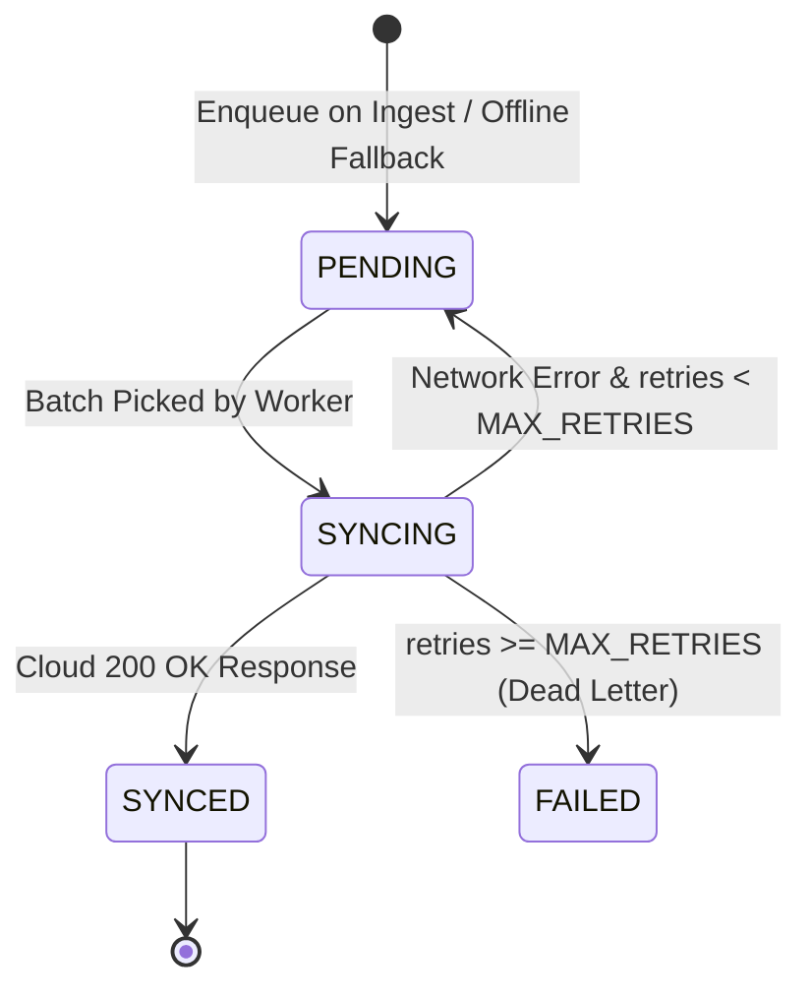

# TerraEdge — Durable Store-and-Forward Queue & Data Recovery

## 1. Store-and-Forward Architecture

When WAN connectivity is disrupted, edge telemetry must not be dropped. In-memory queues risk catastrophic data loss during power cycles, battery exhaustion, or process restarts.

TerraEdge implements a **Durable SQLite WAL (Write-Ahead Logging) Store-and-Forward Queue**:
- **Location**: `gateway/data/backhaul_queue.db` (configurable via `BACKHAUL_QUEUE_DB_PATH`).
- **Engine**: Embedded SQLite3 in WAL journal mode (`PRAGMA journal_mode=WAL`).
- **Durability**: 100% crash-safe and power-failure resistant.

---

## 2. Queue Schema & Timestamp Preservation

```sql
CREATE TABLE IF NOT EXISTS backhaul_queue (
    queue_id TEXT PRIMARY KEY,
    record_type TEXT NOT NULL,
    record_id TEXT NOT NULL,
    payload TEXT NOT NULL,
    observed_at TEXT NOT NULL,
    created_at TEXT NOT NULL,
    synced_at TEXT,
    retry_count INTEGER DEFAULT 0,
    status TEXT DEFAULT 'PENDING',
    last_error TEXT,
    UNIQUE(record_type, record_id)
);

CREATE INDEX IF NOT EXISTS idx_queue_status_type
ON backhaul_queue(status, record_type, created_at);
```

### Critical Invariants:
1. **Original Timestamp Preservation (`observed_at`)**:
   The exact physical sensor timestamp when the reading was taken in the field is preserved immutably. When synchronized hours later after a network restoration, `observed_at` is preserved, preventing temporal distortion in cloud analytics.
2. **Idempotency (`UNIQUE(record_type, record_id)`)**:
   Prevents duplicate rows on retries or repeated sensor ingest calls via `ON CONFLICT DO UPDATE`.

---

## 3. Relational Dependency Ordering

In cloud backends (e.g., Supabase / PostgreSQL), foreign key constraints require parent records to exist before child records:
- Nodes must exist before Telemetry.
- Telemetry must exist before Predictions.
- Predictions must exist before Alerts.
- Alerts must exist before Dispatches.

When flushing buffered offline data, `DurableBackhaulQueue.fetch_pending()` guarantees strict priority-ordered retrieval:

$$\text{Priority 1: NODE} \longrightarrow \text{Priority 2: TELEMETRY} \longrightarrow \text{Priority 3: PREDICTION} \longrightarrow \text{Priority 4: ALERT} \longrightarrow \text{Priority 5: DISPATCH}$$

---

## 4. Lifecycle & Failure Handling



### Dead-Letter & Retry Policy
- Configurable maximum retries (`BACKHAUL_MAX_RETRIES=5`).
- Incremental retry counter on transient failures.
- Non-blocking: one permanently poisoned record transitions to `FAILED` without stalling the rest of the queue.

---

## 5. Verification & Testing Summary

1. **Crash Durability**: Tested in `tests/test_phase7_backhaul.py::test_queue_restart_durability` (database instance destroyed and re-opened from disk, 100% record recovery).
2. **Relational Ordering**: Tested in `tests/test_phase7_backhaul.py::test_queue_relational_dependency_ordering` (reverse-inserted records returned in exact $1 \to 2 \to 3 \to 4 \to 5$ order).
3. **Idempotency**: Tested in `tests/test_phase7_backhaul.py::test_queue_idempotent_deduplication`.
4. **End-to-End Blackout Sync**: Demonstrated via `gateway/backhaul_demo.py`.
